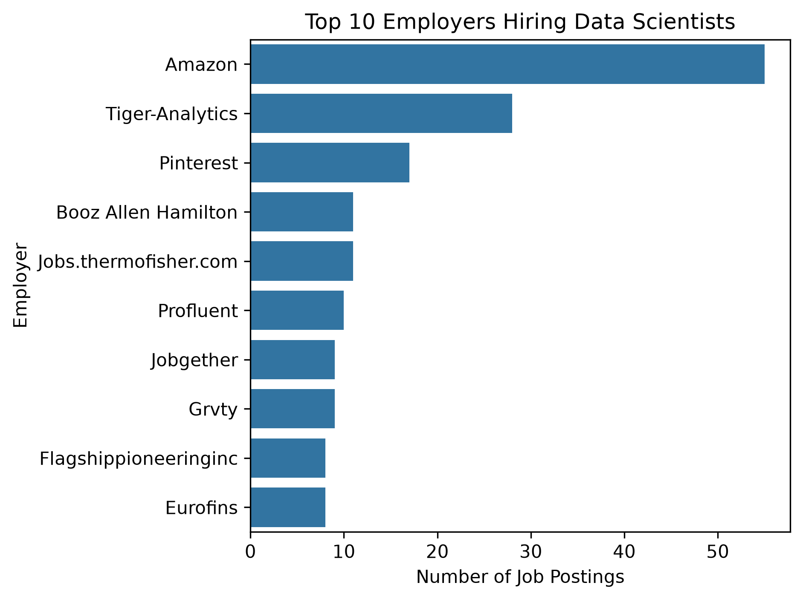
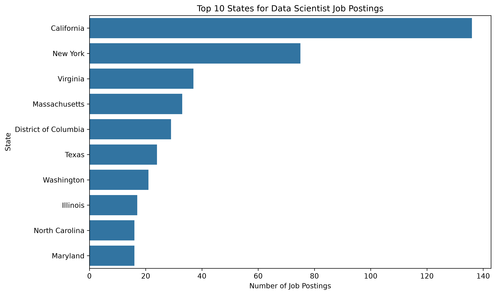
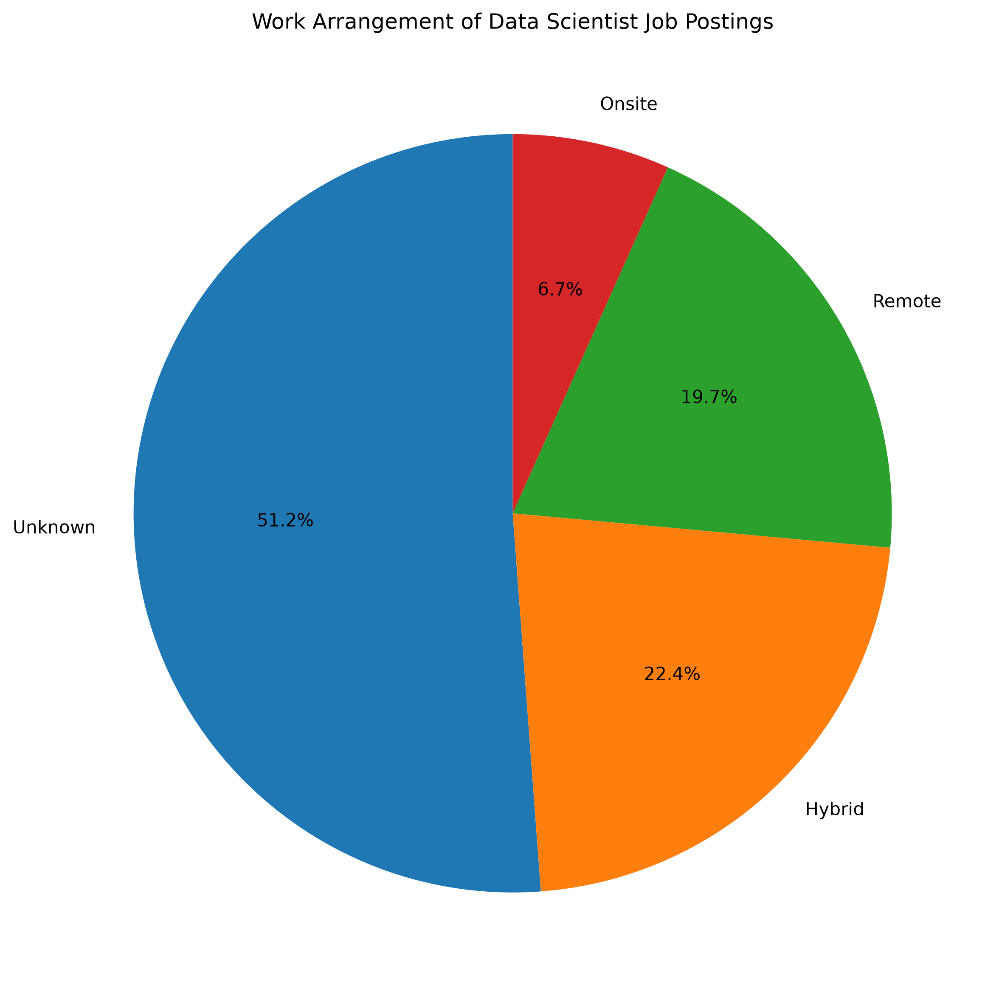
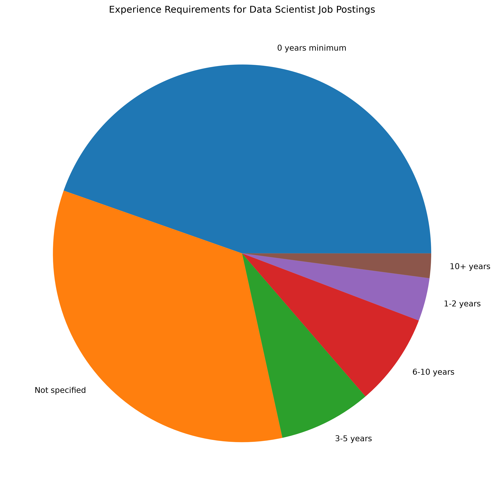
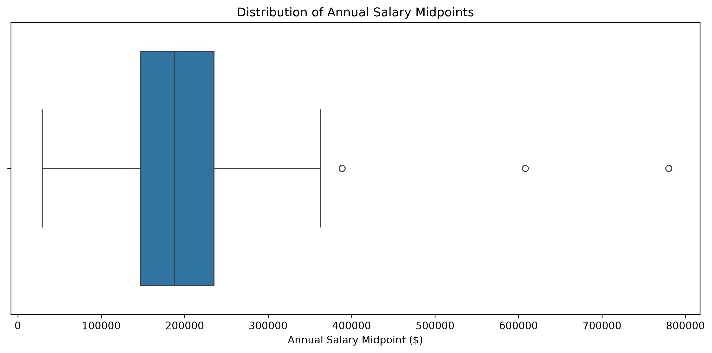
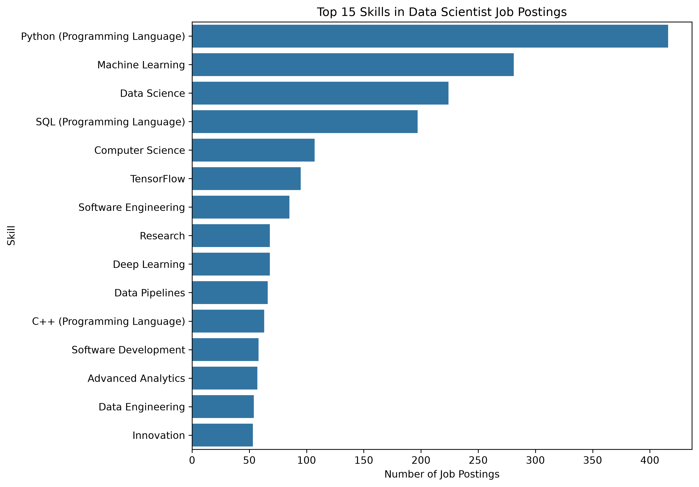
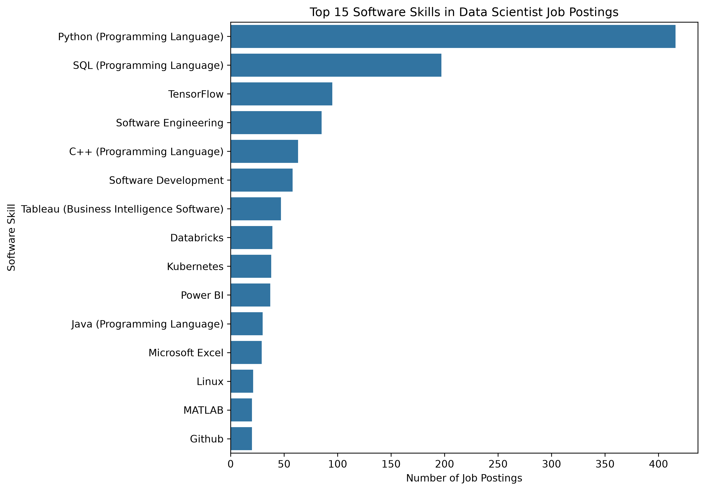

## Purpose

This page provides an overview of the 2026 job market for **Data Scientists within Scientific Research and Development Services**.

**Industry:** Scientific Research and Development Services  
**NAICS code:** 5417  
**Career pathway:** Data Scientists  
**Dates covered:** January 6, 2026–August 23, 2026  
**Final dataset:** 760 job postings

## Market Overview

The cleaned dataset contains **760 Data Scientist job postings within NAICS 5417**. The baseline examines job titles, employers, geographic patterns, work arrangements, experience requirements, salaries, and skills in demand.

These findings describe the postings contained in the MET Career Compass dataset and should not be interpreted as a complete census of every Data Scientist position in the United States.

### Main Findings

| **Measure** | **Result** |
|---|---:|
| Final job postings | 760 |
| Postings with skills data | 733 (96.4%) |
| Postings with usable salary data | 240 (31.6%) |
| Average salary midpoint | $195,417 |
| Most common employer | Amazon (55 postings) |
| Leading identified state | California (136 postings) |
| Hybrid postings | 170 |
| Remote postings | 150 |
| Most frequently listed skill | Python (416 postings) |

The final market panel provides strong coverage for skills analysis, while salary, location, and work-arrangement information are less complete.

---

## Job Volume by Title

The Data Scientists occupation contains several different employer-facing job titles. The table below shows the most frequently occurring titles in the final dataset.

### Top Job Titles

| **Job Title** | **Postings** |
|---|---:|
| Data Scientists | 207 |
| Data Scientist | 19 |
| Machine Learning Engineer | 15 |
| Senior Machine Learning Engineer | 14 |
| Senior Data Scientist | 14 |
| Staff Machine Learning Engineer | 9 |
| Senior AI Engineer | 8 |
| Machine Learning Research Engineer | 8 |
| AI Engineer | 6 |
| Agentic AI Engineer | 5 |

The standardized **Data Scientists** title is the largest individual title group with 207 postings. The remaining postings include a variety of Data Scientist, Machine Learning, and AI-related titles, showing that relevant opportunities may appear under several different job titles.

---

## Top Employers

### Employer Results

| **Employer** | **Postings** |
|---|---:|
| Amazon | 55 |
| Tiger Analytics | 28 |
| Pinterest | 17 |
| Jobs.thermofisher.com | 11 |
| Booz Allen Hamilton | 11 |
| Profluent | 10 |
| Jobgether | 9 |
| Grvty | 9 |
| Flagshippioneeringinc | 8 |
| Eurofins | 8 |

{fig-align="center" width="85%"}

*Figure 1: Employers with the most Data Scientist job postings.*

Amazon had the highest number of Data Scientist postings with **55 jobs**, followed by **Tiger Analytics with 28** and **Pinterest with 17**. Hiring is distributed across many employers, although Amazon represents the largest individual source of postings in the dataset.

---

## Geographic Patterns

### Top Identified States

| **State** | **Postings** |
|---|---:|
| California | 136 |
| New York | 75 |
| Virginia | 37 |
| Massachusetts | 33 |
| District of Columbia | 29 |
| Texas | 24 |
| Washington | 21 |
| Illinois | 17 |
| North Carolina | 16 |
| Maryland | 16 |

{fig-align="center" width="85%"}

*Figure 2: States with the most identified Data Scientist job postings.*

Among postings with a known state, **California had the most postings with 136**, followed by **New York with 75** and **Virginia with 37**. However, 264 postings had an unknown state, so these results describe the geographic concentration of postings with identifiable locations.

---

## Remote, Hybrid, and Onsite Work

### Work Arrangement Results

| **Work Arrangement** | **Postings** | **Share** |
|---|---:|---:|
| Unknown | 389 | 51.2% |
| Hybrid | 170 | 22.4% |
| Remote | 150 | 19.7% |
| Onsite | 51 | 6.7% |
| **Total** | **760** | **100.0%** |

{fig-align="center" width="70%"}

*Figure 3: Data Scientist job postings by work arrangement.*

Work arrangement was unknown for **389 of the 760 postings**, while 170 were hybrid, 150 remote, and 51 onsite. Among postings with a known arrangement, hybrid and remote opportunities were considerably more common than fully onsite positions.

---

## Experience Requirements

### Experience Results

| **Experience Requirement** | **Postings** | **Share** |
|---|---:|---:|
| 0 years minimum | 339 | 44.6% |
| Not specified | 257 | 33.8% |
| 3–5 years | 60 | 7.9% |
| 6–10 years | 60 | 7.9% |
| 1–2 years | 28 | 3.7% |
| 10+ years | 16 | 2.1% |
| **Total** | **760** | **100.0%** |

{fig-align="center" width="70%"}

*Figure 4: Minimum experience requirements for Data Scientist job postings.*

The largest category was **0 years minimum with 339 postings**, while experience was not specified for another **257 postings**. Higher minimum experience requirements were less common, with only 16 postings requiring 10 or more years.

---

## Salary Distribution

### Salary Results

| **Salary Measure** | **Result** |
|---|---:|
| Postings with usable salary data | 240 of 760 |
| Salary coverage | 31.6% |
| Mean minimum salary | $160,852 |
| Mean maximum salary | $229,983 |
| Mean salary midpoint | $195,417 |
| Median minimum salary | $152,000 |
| Median maximum salary | $220,000 |
| Median salary midpoint | $187,675 |
| Minimum salary midpoint | $29,120 |
| Maximum salary midpoint | $780,000 |
| Potential outliers flagged | 3 |

{fig-align="center" width="85%"}

*Figure 5: Distribution of annual salary midpoints for postings with usable salary data.*

Usable salary information was available for **240 postings (31.6%)**, with a median annual salary midpoint of **$187,675** and an average midpoint of approximately **$195,417**. Salary values varied substantially, so the results describe only the subset of postings that reported usable compensation.

---

## Skills in Demand

Skills information was available for **733 of the 760 postings**, representing approximately **96.4% coverage**.

### Top Skills

| **Skill** | **Postings** |
|---|---:|
| Python | 416 |
| Machine Learning | 281 |
| Data Science | 224 |
| SQL | 197 |
| Computer Science | 107 |
| TensorFlow | 95 |
| Software Engineering | 85 |
| Research | 68 |
| Deep Learning | 68 |
| Data Pipelines | 66 |

{fig-align="center" width="85%"}

*Figure 6: Most frequently listed skills in Data Scientist job postings.*

**Python was the most frequently listed skill with 416 postings**, followed by **Machine Learning with 281, Data Science with 224, and SQL with 197**. These results show strong demand for programming, machine-learning, and data-science capabilities within the selected market.

---

## Software Skills

### Top Software Skills

| **Software Skill** | **Postings** |
|---|---:|
| Python | 416 |
| SQL | 197 |
| TensorFlow | 95 |
| Software Engineering | 85 |
| C++ | 63 |
| Software Development | 58 |
| Tableau | 47 |
| Databricks | 39 |
| Kubernetes | 38 |
| Power BI | 37 |

{fig-align="center" width="85%"}

*Figure 7: Most frequently listed software and technology skills.*

**Python again ranked highest with 416 postings**, followed by **SQL with 197 and TensorFlow with 95**. Tableau, Databricks, Kubernetes, and Power BI also appear frequently, showing demand for a mix of programming, machine-learning, data-platform, and visualization technologies.

---

## What This Means for Job Seekers

The market baseline suggests that Data Scientist opportunities within NAICS 5417 appear under a range of titles, including Data Scientist, Machine Learning Engineer, and AI-related roles. Job seekers may therefore benefit from searching across several related titles rather than relying on one exact job title.

The skills results provide a particularly clear signal for career preparation. **Python, Machine Learning, Data Science, and SQL** are among the most frequently requested capabilities, while TensorFlow, Tableau, Databricks, Kubernetes, and Power BI represent additional technologies that may strengthen a candidate's technical profile.

---

## Limitations

- The dataset contains **760 selected postings** and does not represent every Data Scientist opening in the United States.
- Salary information is available for only **240 postings (31.6%)**.
- State information is unknown for **264 postings**.
- City information is unknown for **280 postings**.
- Work arrangement is unknown for **389 postings**.
- Experience requirements are not specified for **257 postings**.
- Employer labels may not be completely standardized.
- The analysis covers January through August 2026 rather than a complete calendar year.

These limitations are retained and reported rather than filling missing information with unsupported assumptions.

---

## Job Market Snapshot

| **Market Indicator** | **Result** |
|---|---:|
| Job postings | **760** |
| Median salary midpoint | **$187,675** |
| Average salary midpoint | **$195,417** |
| Remote or hybrid postings | **320** |
| Most in-demand skill | **Python — 416 postings** |
| Leading identified state | **California — 136 postings** |
| Top employer | **Amazon — 55 postings** |

The market baseline establishes the demand-side benchmark that will be used in the project's later Skill Gap Analysis and Career Evaluation.